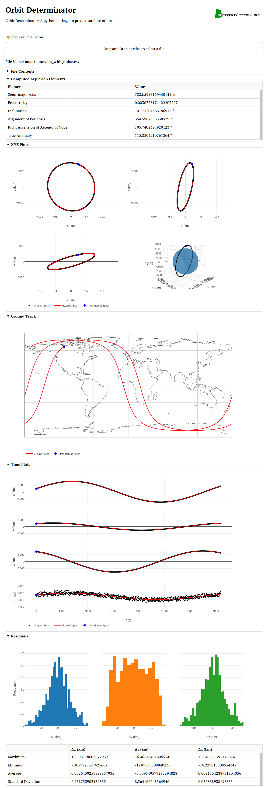

# Orbitdeterminator-Webapp: A webapp for [Orbit Determinator](https://github.com/aerospaceresearch/orbitdeterminator)

[](https://travis-ci.org/aerospaceresearch/orbitdeterminator-webapp)

## Quick Start

__orbitdeterminator__ is a package written in python3 for determining orbit of satellites based on positional data. Various filtering and determination algorithms are available for satellite operators to choose from. This is the webapp for orbitdeterminator.

### Installation Instructions
Clone the repository and cd into it.
```
git clone https://github.com/aerospaceresearch/orbitdeterminator-webapp
cd orbitdeterminator-webapp
```
Install OrbitDeterminator
```
pip install git+https://github.com/aerospaceresearch/orbitdeterminator
installation guide for orbitdeterminator-https://github.com/aerospaceresearch/orbitdeterminator/blob/master/README.md
if you are using ubuntu, install python3-tk using: sudo apt-get install python3-tk
if you are still getting an error explicitly mention python3 instead of python wherever required during installation
if your system doesn't have python3 then first install python3
```
Install other requirements
```
pip install -r requirements.txt
```

### Usage
Run the app with `python app.py`. Go to [http://localhost:8050](http://localhost:8050) to view the app.

See [here](http://orbit-determinator.readthedocs.io/en/latest/) for OrbitDeterminator documentation.


